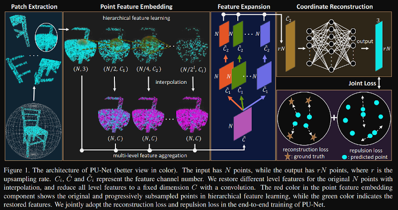
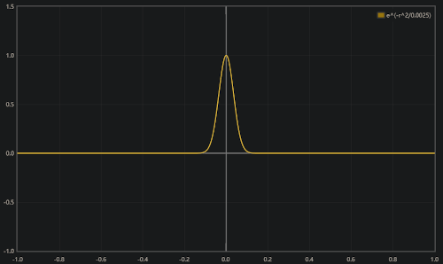
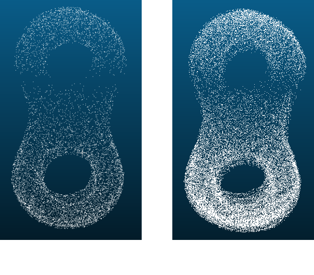

# PU-Net: Point Cloud Upsampling Network

> PU-Net是第一篇采用深度学习进行点云上采样的工作，其思路是通过PointNet++网络提取每个点的特征，再通过扩增特征的方式扩增点的数量，扩增特征的方式为直接复制，为了增加复制后的点云特征的多样性使用了两个卷积层进一步提取特征，最后使用扩增后的特征重建点云，为了保证重建点云的质量，加入了reconstruction loss和repulsion loss分别用于约束上采样的点分布在表面以及约束上采样的点均匀分布。

## 1. Introduction

- 本工作是第一个将深度学习用于点云上采样的工作，在此之前，PointNet、PointNet++、deep Kd-Networks等工作已经探索了深度学习在点云上的应用，深度神经网络用于从点云中直接提取点的特征，而不需要使用传统的人工特征，这些工作在点云分类和分割任务上有着优秀的表现。

- 点云上采样：给定一组三维点，在保证其原来的几何表面形状的前提下使得点的分布更加稠密，但是不要求原点云是加密后的点云的子集。

- 点云上采样与二维图像中的超分辨率问题类似，但是存在着更多的挑战：

  |          | 图像超分辨率       | 点云上采样         |
  | -------- | ------------------ | ------------------ |
  | 研究对象 | 规则的像素网格     | 不规则的三维点集合 |
  | 点的分布 | 生成的点的位置固定 | 生成点的位置不固定 |

  - 二者的相同点是输出数据不需要是输入数据的超集。
  - 由于上采样得到的点只能存在于有目标物体的表面，所以简单的插值方法无法解决。

- 通俗地理解PU-Net：为了能够让网络更好地学习到局部特征，首先对点与进行切分，分成一系列的patch作为上采样的对于输入的点云。首先使用PointNet++提取每个点的局部特征，这个局部特征能够反映一个点周围的邻域信息，然后将每个点的特征复制多份，由于每个点的特征能够反映其邻域信息，所以理论上也能够通过该特征去生成该点周围的点。为了能用复制的特征得到不同的上采样点，需要增加特征的多样性，作者这里将复制的同样的特征使用不同的卷积进一步提取特征，同时采用repulsion loss使得上采样的点不会聚在一起，而是均匀分布，reconstruction loss使得上采样得到的点分布在表面，从而达到点云上采样的目的。

## 2. Method and Code



- 如上图所示，PU-Net分为四个部分，首先将点云切分成不同大小，不同分布的patch；然后使用PointNet++逐级地提取每个点的局部特征；接着将得到的点云的特征复制若干份（根据上采样密度决定），为了使得复制后的特征具有多样性，使用两层不同的卷积对复制的特征分别进行进一步特征提取；最后将所有的特征concatenate在一起，达到了特征扩充的效果，然后将每个点的多维特征通过一系列的卷积降至3维，从而达到扩增点的目的，为了能够使得扩增的点符合上采样的要求，这里采用了两种loss来约束上采样点的分布。

  > ​		是否可以使用流形假设做如下解释，是指“自然的原始数据是低维的流形嵌入于(embedded in)原始数据所在的高维空间”。这里是否可以理解为我们首先使用PointNet++将每个点的信息映射到低维流形上（这里应该理解为信息的维度，而不是简单的向量维度），得到的就是每个点在低纬流形上的表征向量，将原始的高维信息映射到低纬流形上有一个好处，就是使得原本在高维中不可分的数据变成可分；Feature Expansion的过程是将表征向量赋值多份，然后使用卷积（实质上就是全连接网络）将表征向量在低纬流形上做个变换（移动），使得其依然能够表征原有的信息，比如保持点是在物体表面上的，然后我们将低纬流形上的表征向量映射回去，得到他们在点云上的位置坐标，通过约束生成点依然在物体表面上和分布均匀，网络逐渐能够懂得如何对原始点云embedding，再将表征向量经过一系列的变换得到能够使得生成点在物体表面上且分布均匀的点的表征向量，最后通过卷积将表征向量转换成三维点。

### 2.1 Patch Extraction

- 为了能够使网络更好地学习到点云的局部特征，并使用局部特征进行点云的上采样，作者提出应当将点云先切分成若干个patch，将patch作为上采样的输入。

  - 具体的切分方法为：首先从Mesh图中随机选择$M$个点，对于这M个点中的任何一个点，选择其测地距离（geodesic distance）$d$内的点组成一个patch，然后使用Poisson disk sampling在patch上随机生成$\hat N$个点。Poisson disk sampling保证了生成的点云分布均匀，故将其作为ground truth。为了让局部和全局信息都能上采样结果做出贡献，作者还设置了不同的$d$用于生成不同大小的patch，这样就可以生成不同大小和密度的patch（$\hat N$不变）。

    > 不直接基于坐标使用KNN而使用测地距离是因为直接使用KNN可能会导致选取的patch不能组成一个完整连续的图形。

- 关于Patch Extraction模块的一点思考和问题：

  > ​		切成patch的好处仅仅是方便学习到点的局部特征吗？是否说明着上采样时，一个点的小范围邻域就足够用来上采样？那么对于上采样来说，最少的信息是什么？如果能够找到的话或许可以加快上采样的过程。对于一个点来说，过多的全局信息是不会增加上采样的效果还是会使得上采样效果更差？
  >
  > ​		切成patch是否引入了其他问题？切成patch再进行特征提取最显然的就是使得patch边缘的点云的信息发生一定程度的失真，因为边缘的点云的邻域中的点变少了，那是否会影响边缘点云的上采样效果。所以更科学的是不是应该先将点云整体作为PointNet++的输入，得到每个点的特征，再用每个点的特征去补充边缘点的特征信息。这里就可以通过使用不同层级的PointNet++提取特征信息，验证更丰富的全局特征是否会影响点云上采样的效果。当然，这个方法也有一定的弊端，即它对存在着点的特征重复提取的问题，如何合理设计避免过多的重复特征提取也是一个问题。
  >
  > ​		不同patch是否有重叠部分？如果有，那么如何将上采样后的patch重新组合成完整的点云。

### 2.2 Point Feature Embedding

- 为了从patches中学习到点的局部特征和全局特征，作者采用了两种网络设计：Hierarchical feature learning、Multi-level feature aggregation

- Hierarchical feature learning：在深度学习中已经被证明的是，不论是在图像还是点云，以hierarchy的方式递进地提取原始数据的local和global特征是一种更为高效的方法。在点云特征提取算法上，PointNet++采用的也是这种hierarchy的方式，使用其提取点云的特征集合了点的local和global特征。但是与点云分类和点云分割不同的是，点云上采样更关注的是点的局部特征，所以这里需要将PointNet++的grouping的区域设置的相对较小，使得网络更多地关注点的局部特征。

- Multi-level feature aggregation：同样已经被证明的是，在hierarchy式的特征提取网络中，由于感受野逐渐变大的原因，较浅层的网络提取到的是点的local feature，更深的网络则能够提取到点的global feature。为了得到更好的上采样结果，就需要合理地将local feature和global feature结合起来，不同于PointNet++采用的包含跳跃连接的cascade结构，PU-Net采用的是将提取到的不同层级的特征插值到原始点云维度大小，然后直接aggregate在一起得到点云中每个点的特征。

  - 下图为PointNet++与PU-Net中合并local feature和global feature的区别，层级式地提取特征的过程可以认为是一样的（层级不一样而已）。
  - 插值特征的方式与PointNet++相同，均使用待插值点最近的K个点（论文中K=3）的特征加权得到，权值为归一化后的欧氏距离的倒数。
  - 为了让网络能够学习到每层特征对于重建的重要性，作者将合并feature过程中不同层的权重设置为可学习的参数。

- 代码：

  - 将PointNet++作为黑盒使用的化，这部分的代码就变得比较简单了，定义网络的代码如下：

    ```python
    self.npoints = [
        npoint, 
        npoint // 2, 
        npoint // 4, 
        npoint // 8
    ]
    mlps = [
        [32, 32, 64],
        [64, 64, 128],
        [128, 128, 256],
        [256, 256, 512]
    ]
    radius = [0.05, 0.1, 0.2, 0.3]
    nsamples = [32, 32, 32, 32]
    in_ch = 0 if not use_normal else 3
    self.SA_modules = nn.ModuleList()
    for k in range(len(self.npoints)):
        self.SA_modules.append(
            PointnetSAModule(
                npoint=self.npoints[k], # int, number of points
                radius=radius[k], # float, radius of ball
                nsample=nsamples[k], # int, number of samples in the ball query
                mlp=[in_ch] + mlps[k], # list of int, spec of the pn before the global max_pool
                use_xyz=True,  # use coord in mlp
                use_res=use_res,  
                bn=use_bn) # batch normalization
        )
        in_ch = mlps[k][-1]
    ```

    - 上面的代码构造了一个模型列表`SA_modules`，其中包含PU-Net的四层特征提取器，`npoints`表示每个提取器输入点云中包含的点的数量，可以看到每经过一个SA层，点云数量减半。`mlps`表示每个特征提取器中隐藏层的宽度，可以看到点云的特征被逐渐提取到512维。

  - 在网络inference过程中，使用上面四层SA层即可完成Point Feature Embedding的操作

    ```python
    l_xyz, l_feats = [xyz], [feats]
    for k in range(len(self.SA_modules)):
        lk_xyz, lk_feats = self.SA_modules[k](l_xyz[k], l_feats[k], npoint=npoints[k])
        l_xyz.append(lk_xyz)
        l_feats.append(lk_feats)
    ```

    - 每个SA_modules的输入是点云的坐标和特征，以及点云中点的数量，返回的是提取特征后的点云的坐标和特征。

  - 然后将第2~4个SA层的Embedding结果插值到原来点云的数量，再将同一个点的不同层的特征拼接起来，得到Embedding层的提取结果，对应的模块定义如下，其中`PointnetFPModule`为PointNet++中扩增点云的模块：

    ```python
    ## upsamples for layer 2 ~ 4
    self.FP_Modules = nn.ModuleList()
    for k in range(len(self.npoints) - 1):
        self.FP_Modules.append(
            PointnetFPModule(
                mlp=[mlps[k + 1][-1], 64], 
                bn=use_bn))
    ```

  - 在推理过程中，分别使用三个扩增函数扩增第2~4个SA层的Embedding结果，并将四层的结果中同一个点的特征拼接起来。

    ```python
    ## upsample
    up_feats = []
    for k in range(len(self.FP_Modules)):
        upk_feats = self.FP_Modules[k](xyz, l_xyz[k + 2], None, l_feats[k + 2])
        up_feats.append(upk_feats)
    feats = torch.cat([
        xyz.transpose(1, 2).contiguous(),
        l_feats[1],
        *up_feats], dim=1).unsqueeze(-1) # bs, mid_ch, N, 1
    ```

### 2.3 Feature Expansion

- 经过上一个模块以后，每个点的特征都被Embedding为一个特征向量，其中包含每个点的局部和全局特征，显然输入的每个点与point feature embedding模块输出的每个点存在着一一对应的关系，那么只要我们扩增特征的数量，就相当于我们在扩增点的数量。

- 这里扩增的方式为简单的直接复制，将point feature embedding模块得到的$N \times \tilde C$复制$r$份，$r$为上采样率，然后将复制的每份作为一个分支，每个经过一系列不同的$1 \times 1$卷积运算，卷积仅在每个点的特征上进行，点与点之间没有相互作用。这里需要说明以下两点

  - 第一点：在embedding以后，每个点理论上应该包含了其领域信息，所以其有能力表达出其周围的信息，也应当具备对其附近进行上采样的能力。
  - 第二点：经过多层卷积的原因是为了保证复制得到的相同的特征具有足够的多样性，否则会导致来自相同特征的点重建后距离太近。

- 代码

  - Feature Expansion模块虽然看起来操作比较多，但是实际上每次都仅仅使用了一个FC层，这部分所使用到的网络定义如下：

    ```python
    in_ch = len(self.npoints) * 64 + 3 # 4 layers + input xyz
    self.FC_Modules = nn.ModuleList()
    for k in range(up_ratio):
        self.FC_Modules.append(
            pt_utils.SharedMLP(
                [in_ch, 256, 128],
                bn=use_bn))
    ```

    - 上采样率`up_ratio`表示需要将点云上采样的倍数，对于输入的点云的$N$个点在Point Feature Embedding过程中，得到了一个`(N,C)`的点云，经过Feature Expansion步骤后，点云数量应该被扩增为`up_ratio*N`个。那么就需要`up_ratio`个FC层得到`up_ratio`个分支。

  - Feature Expansion模块的inference过程入下：

    ```python
    ## expansion
    r_feats = []
    for k in range(len(self.FC_Modules)):
        feat_k = self.FC_Modules[k](feats) # bs, mid_ch, N, 1
        r_feats.append(feat_k)
        r_feats = torch.cat(r_feats, dim=2) # bs, mid_ch, r * N, 1
    ```

    - 首先让点云分别通过`k`次`up_ratio`个FC层，然后将得到的`up_ratio`个点云拼接起来，得到扩增后的点云。

### 2.4 Coordinate Reconstruction

- 根据扩增后的特征重建扩增的点云比较简单，直接使用每个点的特征回归（regress）每个点的三维坐标即可。

- 具体来说，该模块的输入为扩增后的特征图，shape为$rN \times \tilde C_2$，以每个点的特征为卷积的对象，经过若干层的$1 \times 1$的卷积，输出上采样点云，shape为$rN \times 3$。

- 代码：

  - 这个阶段仅需要一个MLP即可，下面定义的是一个两层的MLP，最终将点云特征降低到三维。得到上采样后的点云。

    ```python
    in_ch = 128
    self.pcd_layer = nn.Sequential(
        pt_utils.SharedMLP([in_ch, 64], bn=use_bn),
        pt_utils.SharedMLP([64, 3], activation=None, bn=False)) 
    ```

  - 对应的inference过程的代码为：

    ```python
    # reconstruction
    output = self.pcd_layer(r_feats) # bs, 3, r * N, 1
    return output.squeeze(-1).transpose(1, 2).contiguous() # bs, 3, r * N
    ```

### 2.5 Training Data Generation

- 由于给定一个稀疏点云，其上采样结果是不唯一的，所以上采样问题本身是一个不适定（ill-posed）问题。但是在监督学习中，必须要有对应于输入值的Ground Truth。如何构建ground truth进行监督训练是数据生成的关键。
- 作者采用了on-the-fly的方式进行数据生成。具体来说，对于一个patch，其ground truth是固定的，即Poisson disk sampling的结果，在每个训练的epoch中，对ground truth进行随机下采样，得到的点云作为上采样的输入。
- 这种方法的好处包括
  - 满足不适定问题的特点。可以这么理解，这种一对多的关系本身就是想表达一种不确定的对应关系，而这里实现的就是一种不确定的对应关系，随机采样并不会造成给定一个稀疏点云就有其确定的上采样结果。
  - 扩增了训练数据量。

### 2.6 Loss Function

- 为了让上采样的点均匀分布在物体表面，这里采用了两种loss function: reconstruction loss 和 repulsion loss。

- Reconstruction loss：这个loss的目的是为了让生成的点都在物体的表面。在一些点云生成的工作中，度量两种点云相似性的方法有两种：Earth Mover’s distance (EMD，推土机距离)和Chamfer Distance (CD，倒角距离)，二者的区别可以参考[知乎](https://zhuanlan.zhihu.com/p/145739750)。论文[A Point Set Generation Network for 3D Object Reconstruction from a Single Image](https://link.zhihu.com/?target=https%3A//arxiv.org/abs/1612.00603)指出EMD loss能够使得输出点更接近underlying object surfaces，其表达式为
  $$
  \begin{equation}
  L_{r e c}=d_{E M D}\left(S_{p}, S_{g t}\right)=\min _{\phi: S_{p} \rightarrow S_{g t}} \sum_{x_{i} \in S_{p}}\left\|x_{i}-\phi\left(x_{i}\right)\right\|_{2}
  \end{equation}
  $$

  - EMD就是找到两个点集的一个双射$\phi$，使得所有对应点之间的距离和最小。

  - EMD的原理见[Blog](https://blog.csdn.net/Gregory24/article/details/104495727)。

- Repulsion Loss：这个loss的目的是为了使生成的点分布更加均匀，其表达式为：
  $$
  \begin{equation}
  L_{r e p}=\sum_{i=0}^{\hat{N}} \sum_{i^{\prime} \in K(i)} \eta\left(\left\|x_{i^{\prime}}-x_{i}\right\|\right) w\left(\left\|x_{i^{\prime}}-x_{i}\right\|\right)
  \end{equation}
  $$

  - 其中$\hat N = rN$表示输出点云的点数量，外层$\Sigma$遍历了所有生成的点。

  - $K(i)$表示点$x_i$最近的$k$个点的index，对于每个生成的点，内层的$\Sigma$遍历了其最近的$k$个点。

  - $\left\|x_{i^{\prime}}-x_{i}\right\|$表示两点之间的距离，$\left\|·\right\|$表示L2-norm。

  - $\eta(r)=-r$称为排斥项，负号是因为希望$L_{res}$的绝对值越大越好。$L_{res}$的绝对值越大说明点之间距离越大。

  - $w(r)=e^{-r^2/h^2}$是一个fast-decaying weight function，表示对排斥项的加权，$r$接近$0$则权重越大，受到的惩罚越大。将h设置为0.05，可以得到 如下函数图像：

    

- 整体的Loss：
  $$
  \begin{equation}
  L(\theta)=L_{r e c}+\alpha L_{r e p}+\beta\|\theta\|^{2}
  \end{equation}
  $$

  - 其中$\theta$代表网络中的参数，$\beta\|\theta\|^{2}$视为了防止过拟合而对网络中参数的大小进行约束，称为权重衰减（weight decay）。$\alpha$用于平衡两个loss函数，$\beta$用于控制权重衰减。
  - 其中$L_{rec}$、$\beta\|\theta\|^{2}$、$\alpha$是正数，$L_{rep}$为负数，因为我们希望$L_{rep}$的绝对值越大越好，所以将其定为负数。

- 代码：

  - 首先是EMD loss:

    ```python
    def get_emd_loss(self, pred, gt, pcd_radius):    idx, _,temp = auction_match(pred, gt)    temp_sum = torch.sum(temp,dim=2)    matched_out = pn2_utils.gather_operation(gt.transpose(1, 2).contiguous(), idx)    matched_out = matched_out.transpose(1, 2).contiguous()    dist2 = (pred - matched_out) ** 2    dist2 = dist2.view(dist2.shape[0], -1)(batch_size,4096*3)    dist2 = torch.mean(dist2, dim=1, keepdims=True)    dist2 /= pcd_radius    return torch.mean(dist2)
    ```

    - 其中，`auction_match`函数用于求解输入的两个点云的EMD，其在实现时实际上实在求解一个指派问题，并使用了拍卖算法进行了并行求解，我在[另一篇笔记](https://github.com/ChambinLee/CUDA_with_PyTorch/blob/main/complex_example_interpretation/EMD_Interpretation.md)中详细地解释了这个算法以及CUDA实现。该函数返回最优的映射关系`idx`。然后通过使用最优映射关系计算两个点云的EMD的距离。

  - 然后是repulsion loss

    ```python
    def get_repulsion_loss(self, pred):
        _, idx = knn_point(self.nn_size, pred, pred, transpose_mode=True)
        idx = idx[:, :, 1:].to(torch.int32) # remove first one
        idx = idx.contiguous() # B, N, nn
        pred = pred.transpose(1, 2).contiguous() # B, 3, N
        grouped_points = pn2_utils.grouping_operation(pred, idx) 
        grouped_points = grouped_points - pred.unsqueeze(-1)
        dist2 = torch.sum(grouped_points ** 2, dim=1)
        dist2 = torch.max(dist2, torch.tensor(self.eps).cuda())
        dist = torch.sqrt(dist2)
        weight = torch.exp(- dist2 / self.h ** 2)
    
        uniform_loss = torch.mean((self.radius - dist) * weight)
        # uniform_loss = torch.mean(self.radius - dist * weight) # punet
        return uniform_loss
    ```

    - 首先使用KNN算法得到点云每个点最近的K个点，然后使用$L_{r e p}$的公式计算得到repulsion loss。

  - 最终的loss是二者的加权和：

    ```python
    get_emd_loss(pred, gt, pcd_radius) * 100 + alpha * get_repulsion_loss(pred)
    ```

    > 这里省略了权重衰减项。

## 一些自己的想法：

### 密度不均匀问题

- PU-Net的输入是Patch，每个Patch的密度被认为是均匀的，其会对输入的patch进行均匀的上采样。其对具有稀疏程度不均匀的输入点云的效果不好（待验证）。如果输入点云密度不均匀，上采样后依然会密度不均匀。然而，真实采集到的点云往往在距离采集设备更远的地方更稀疏 ，所以我认为如何做到密度自适应的上采样保证对密度不同的区域进行针对性地上采样也是一个值得研究的问题。结果见后图。

  - 如何解决这个问题呢？想到的一个方法是首先在网络一开始计算每个点的局部密度，然后在Feature Expansion的结构中加入Dropout，局部密度大越大的点越有可能被丢弃。假设输入点云为$P=\{p_1,p_2,...,p_n\}$，每个点$p_i$的局部密度为$d_i$，如果每个点不被drop的概率为$\frac{\alpha}{d_i} $，其中$\alpha$为超参数，那么理论上每个点$p_i$的局部密度经过上采样后的密度均为$\alpha$，通过调节$\alpha$理论上就可以将密度不均匀的点云上采样至均匀的点云。

  - 基于上面的想法，我们应当在loss函数中加入对不均匀上采样的惩罚。记上采样后点云$P^{\prime}=\{p_1^{\prime},p_2^{\prime},...,p_m^{\prime}\}$每个点的局部密度为$d^{\prime}_i$，则惩罚可以表示为上采样后点云中所有点的局部密度的方差：
    $$
    L_{dst}=\frac{\sum\left(d_{i}^{\prime}-\bar{d^{\prime}}\right)^{2}}{m-1}
    $$

### 网络泛化能力

- PU-Net的上采样率是固定的，也就是说一个训练好的PU-Net其只能进行一种上采样率，如果我们想对不同稀疏程度的点云进行不同程度的上采样，包括Meta-PU在内的一些工作就是针对这一点进行了改进。对于这个问题，我暂时没有什么好的想法，但是会持续关注。

## 运行结果展示

- 一些常见的规则点云测试结果见： [results.md](results.md) 

- 对于密度不均匀点云的上采样结果如下，可以看到，PU-Net对于密度不均匀的输入点云得到的结果依然是密度不均匀的。

  

## 环境搭建的一些注意事项

- 经过不知道多少次测试后证明，项目可以可以在CUDA10.0、pytorch1.2、python3.6.6上正确运行。

  > 对于30系的显卡，最低的CUDA要求为11.0，但是CUDA11.0弃用了该项目的一些语法（例如`__shfl_down`），直接使用将无法成功编译核函数，需要根据报错信息修改PointNet++和PU-Net中核函数的一些语句。我尝试修改以后虽然能够成功运行，但是运行结果是错的，loss居高不下。故为了保持正确性，强烈建议使用上述环境，避免一些不必要的麻烦和重复劳动。

- 如果编译核函数遇到pytorch报错C++与pytorch版本不和，可以参考这个[页面](https://github.com/NVIDIA/apex/issues/974)使用`export CXX=g++`将编译器换成g++。

